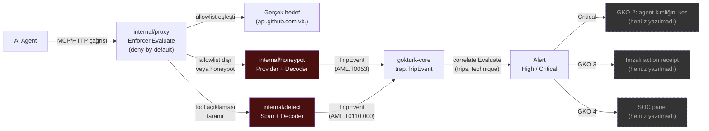

# GÖKKALKAN

Agentic AI Runtime Security — MCP/agent egress proxy + agent honeypot deception.
Göktürk platformunun P2'si (bkz. [gokturk-core](https://github.com/GokturkFK/gokturk-core),
[gokturk-deception-mesh](https://github.com/GokturkFK/gokturk-deception-mesh)).
Görev dökümü: [PROJECT_PLAN.md](PROJECT_PLAN.md).

**Tek cümlelik hedef:** Zehirli bir tool açıklamasıyla yetkisiz bir uca
bağlanmaya çalışan bir AI agent, egress proxy tarafından **kesilir**; panelde
Critical alarm + imzalı action receipt üretilir — meşru bir tool çağrısı ise
hiçbir engelle karşılaşmaz.

> Durum: güvenlik çekirdeği (GK-A, GK-B) hazır — egress proxy
> (`internal/proxy`), agent honeypot (`internal/honeypot`) ve tool-poisoning
> tespiti (`internal/detect`) yazıldı ve test edildi. Korelasyon→enforcement
> wiring (GKO-2), imzalı receipt (GKO-3) ve panel entegrasyonu (GKO-4) henüz
> yazılmadı — bu üçü olmadan proxy/honeypot bir binary içinde birbirine
> bağlı çalışmaz.

## Nereden başlanır

**Tüm işler [issue](../../issues) olarak açık ve atanmış.** Etiketler:
`cyber` = @fetihcakmak (güvenlik çekirdeği), `devops` = @uzunkubra50
(platform/teslimat/wiring). Hangi dosya kimin: [CODEOWNERS](CODEOWNERS).

| Sıra | Issue | Kim | Durum |
|---|---|---|---|
| 1 | [#1 GK-S0](../../issues/1) — Sprint 0 tasarım kararı | @fetihcakmak | ✅ tamamlandı |
| 2 | [#2 GK-A1](../../issues/2) egress proxy · [#4 GK-B1](../../issues/4) agent honeypot | @fetihcakmak | ✅ tamamlandı |
| 3 | [#3 GK-A2](../../issues/3) jailbreak/tool-poisoning tespiti | @fetihcakmak | ✅ tamamlandı |
| 4 | [#5 GK-F1](../../issues/5) tehdit modeli | @fetihcakmak | mimari+tehdit modeli tamam, demo GIF GKO-2 sonrası |
| 5 | [#6](../../issues/6) migration | @uzunkubra50 | ✅ tamamlandı |
| **SIRADA** | [#7](../../issues/7) korelasyon+enforcement wiring | @uzunkubra50 | proxy/honeypot/detect'i tek binary'de bağlar |
| son | [#8](../../issues/8) imzalı receipt · [#9](../../issues/9) panel | @uzunkubra50 | #7'ye bağımlı |

Teknik kararlar için [docs/DECISIONS.md](docs/DECISIONS.md), tehdit modeli
için [docs/THREAT_MODEL.md](docs/THREAT_MODEL.md).

## Mimari

`gokturk-core`'u import eder: `trap.Provider`/`TripEvent` sözleşmesi ve
`correlate.Evaluate` korelasyon motoru GÖKTÜRK ile aynı, kopyalanmaz.
Tehdit modeli ve NSA MCP / OWASP Agentic Top 10 eşlemesi için bkz.
[docs/THREAT_MODEL.md](docs/THREAT_MODEL.md).



**Paketler:**

| Paket | Sorumluluk | Sözleşme |
|---|---|---|
| `internal/proxy` | Deny-by-default allowlist kararı (host/method/path-prefix) | saf fonksiyon, `Store` arkasında DB soyut |
| `internal/honeypot` | Sahte MCP tool provision + tetiklenme tespiti | `gokturk-core/trap.Provider`, `trap.Decoder` |
| `internal/detect` | Tool açıklamasında prompt-injection/tool-poisoning taraması | `gokturk-core/trap.Decoder` |

Üçü de DB erişimini `Store` arayüzü arkasına soyutlar; gerçek Postgres
implementasyonu ve bu paketleri tek bir binary'de birbirine bağlayan wiring
GKO-2'nin işi (bkz. [PROJECT_PLAN.md](PROJECT_PLAN.md) EPIC GK-C).

## Geliştirme

```sh
cp deployments/docker/.env.example deployments/docker/.env
make build
make test
make lint
```

## Stack'i ayağa kaldırma

```sh
make docker-up
```

## Migration'lar

```sh
make migrate-up
make migrate-down
```

## Branch & PR kuralları

`gokturk-deception-mesh` ile aynı: `main` korumalı, PR + CI zorunlu, squash-only,
force-push/branch silme kapalı.
